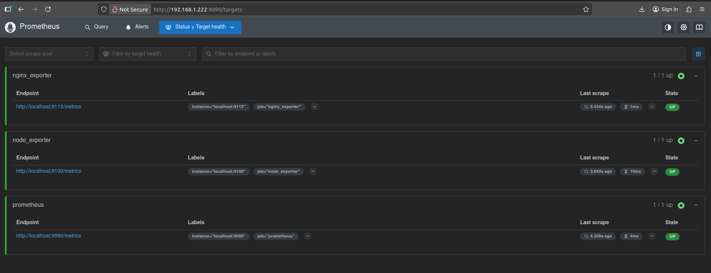
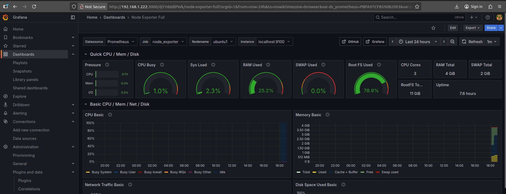

# Linux SysAdmin Portfolio Project – Secure Web Hosting, Automation & Monitoring


> **Purpose:** This repository is a **portfolio showcase of my Linux sysadmin skills**.  

---

## What I built

- **Step 1 – Secure baseline:** updates, static IP (Netplan), SSH keys only, hardened `sshd_config`, UFW rules, Fail2Ban jail.  
- **Step 2 – Web + DB:** Nginx virtual host (`myproject.local`), HTTP/HTTPS (self‑signed cert for local), MySQL secure install, user/db provisioning.  
- **Step 3 – Automation:** a tiny health‑check script, cron scheduling, logrotate for custom logs, dedicated service user.  
- **Step 4 – Monitoring:** Prometheus + node_exporter + nginx‑prometheus‑exporter, Grafana dashboards, UI‑visible alert rules.  
- **Step 5 – Backups & DR:** daily `tar` archive into `/backups/YYYY‑MM‑DD` + `rsync` to a remote box; restore test; 7‑day cleanup.

Each step is documented in `/docs` with screenshots and commands I actually ran.

---

## Where to look

- [docs/serversetup_hardening.md](docs/serversetup_hardening.md) – static IP, SSH hardening, UFW & Fail2Ban.  
- [docs/web_server_db.md](docs/web_server_db.md) – Nginx vhost, HTTPS (self‑signed), MySQL basics.  
- [docs/automation_maintenance.md](docs/automation_maintenance.md) – health script, cron, logrotate.  
- [docs/monitoring_with_prometheus_grafana.md](docs/monitoring_with_prometheus_grafana.md) – Prometheus, exporters, Grafana, alert rules.  
- [docs/backup_disaster_recovery.md](docs/backup_disaster_recovery.md) – backup script, rsync to remote, restore & cleanup.  

---

## Repo layout (short)

```
.
├─ docs/             # Step-by-step guides + screenshots
├─ configs/          # Sanitized config samples
├─ scripts/          # Small helper scripts used in the docs
```

---

### NGINX
- `configs/nginx/myproject.conf` – virtual host (HTTP+HTTPS self‑signed example).  
- `configs/nginx/stub_status.conf` – local status endpoint for NGINX exporter.

### Prometheus
- `configs/prometheus/prometheus.yml` – core scrape config + rule includes.  
- `configs/prometheus/rules/system.yml` – host health alerts.  
- `configs/prometheus/rules/nginx.yml` – NGINX alerts.

### Grafana
- `configs/grafana/provisioning/datasources/prometheus.yml` – pre-provisioned Prometheus data source.

### Fail2Ban
- `configs/fail2ban/jail.local` – basic SSH protection with UFW actions.

### Logrotate (custom)
- `configs/logrotate/healthcheck` – rotates `/var/log/health-check.log` from my tiny script.

---

## Notes for reviewers

- **Security mindset:** explicit denials, least privilege (dedicated users), and log access via groups only when needed.  
- **Ops habits:** validate configs before reloads, use systemd units, rotate logs, and keep simple, readable scripts.  
- **Monitoring approach:** start small (host + NGINX metrics), surface issues in the Prometheus/Grafana UI first.  
- **Backups:** keep it boring—automate, send off‑box, verify restore, enforce retention.  

---

## 🌟 Highlights

<p align="center">
  <br>
  <em>Firewall configured and active using UFW for secure inbound traffic control.</em>
</p>

<p align="center">
  <br>
  <em>Nginx virtual host configured with local HTTPS and static site deployment.</em>
</p>

<p align="center">
  <br>
  <em>Prometheus successfully scraping system and NGINX exporters for live metrics.</em>
</p>

<p align="center">
  <br>
  <em>Grafana dashboard visualizing CPU, memory, and disk usage in real time.</em>
</p>

<p align="center">
  <br>
  <em>Disaster recovery validated by restoring backup on a test system.</em>
</p>


## About Me

**Amel Nebic** — Linux, automation, and practical monitoring.  
GitHub: https://github.com/rootanebic  
LinkedIn: https://www.linkedin.com/in/amel-nebic-75890718a/

If you enjoyed the project, a ⭐ helps others find it.
