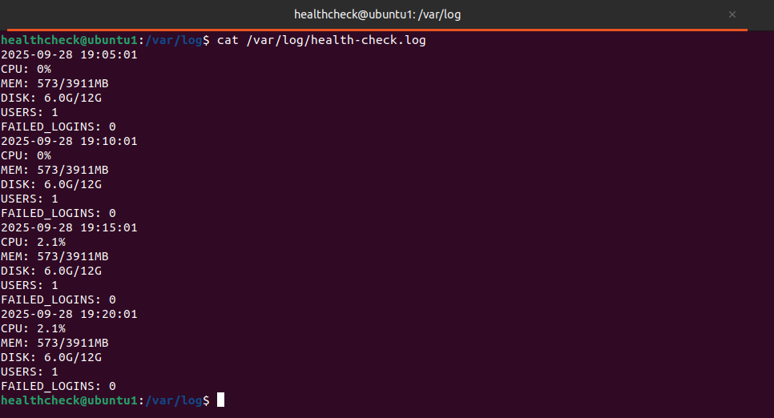

# Step 3: Automation & Maintenance

Hi! In this guide, I'll show you step by step how I automated system maintenance tasks on my Ubuntu server using scripts, cron jobs, and basic monitoring.

---

## 1. Create Dedicated User for Scripts

Instead of using root or the main user, I created a dedicated user `healthcheck` to run all automation scripts:

```bash
sudo adduser healthcheck
sudo usermod -aG adm healthcheck
```

This user will own all scripts and run cron jobs for automation tasks, and being in the `adm` group allows it to read system logs like `/var/log/auth.log`.


---

## 2. System Health Check Script

First, I created the directory for scripts and placed the script inside:

```bash
sudo mkdir -p /home/healthcheck/scripts/
sudo nano /home/healthcheck/scripts/health-check.sh
```

System healt check script:

```bash
#!/bin/bash
# health-check.sh
# Description: This script collects system health information including CPU, memory, disk usage,
# number of logged-in users, and failed SSH login attempts. It appends the output to /var/log/health-check.log

DATE=$(date '+%Y-%m-%d %H:%M:%S')
CPU=$(top -bn1 | grep "Cpu(s)" | awk '{print $2 + $4}')
MEM=$(free -m | awk 'NR==2{printf "%s/%sMB", $3,$2 }')
DISK=$(df -h / | awk 'NR==2{print $3"/"$2}')
USERS=$(who | wc -l)
FAILED_LOGINS=$(grep 'Failed password' /var/log/auth.log | wc -l)

echo "$DATE 
CPU: $CPU% 
MEM: $MEM 
DISK: $DISK 
USERS: $USERS 
FAILED_LOGINS: $FAILED_LOGINS" >> /var/log/health-check.log
```

Set ownership and permissions (read/write/execute only for owner) and give execute permission:

```bash
sudo chown healthcheck:healthcheck /home/healthcheck/scripts/health-check.sh
chmod 700 /home/healthcheck/scripts/health-check.sh
```


Ensure `healthcheck` can read `/var/log/auth.log` via group permissions:

```bash
sudo chmod 640 /var/log/auth.log
```


---

### Log Rotation

Setup log rotation for `healthcheck` logs:

```bash
sudo nano /etc/logrotate.d/healthcheck
```

Logrotation added configuration:

```
/var/log/health-check.log {
    daily
    rotate 14
    compress
    missingok
    notifempty
    create 640 healthcheck adm
}
```

Check logrotate status:

```bash
sudo systemctl status logrotate
```


---

### Cron Setup

Install and verify cron is available:

```bash
sudo apt update && sudo apt install cron -y
```


Scheduled the health-check script to run every 5 minutes using the `healthcheck` user:

```bash
sudo -u healthcheck crontab -e
```


Add the following line:

```
*/5 * * * * /home/healthcheck/scripts/health-check.sh
```

List existing cron jobs:

```bash
sudo -u healthcheck crontab -l
```


## 3. Document Scripts and Example Outputs

All scripts are stored in `/home/healthcheck/scripts/`. Example outputs are saved in `/var/log/health-check.log` and documented for review.




---

## ✅ Summary

* Created a dedicated user `healthcheck` for automation tasks.
* Added `healthcheck` to the `adm` group for log access.
* Bash scripts created for system health checks and the future automated tasks.
* Cron jobs configured under `healthcheck` to run at scheduled intervals.
* Permissions set to `700` for scripts to ensure only the owner can read, write, and execute.
* Logrotate configured for `healthcheck` logs to manage log size and retention.
* Verified `logrotate` service status with `systemctl`.
* Logs collected and documented for easy monitoring and maintenance.
