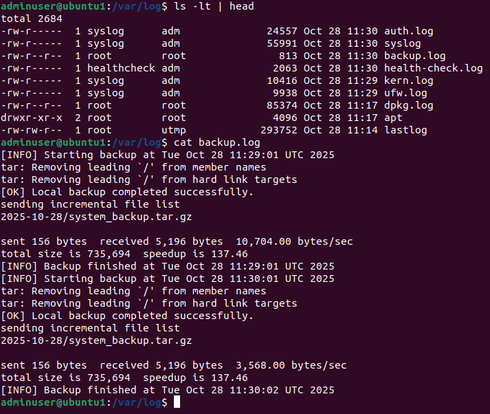

# Step 6: Backup & Disaster Recovery

Hi! In this guide, I’ll show you how I created a simple but reliable backup and disaster recovery setup on my Ubuntu server.  
The goal was to make sure that even if something goes wrong — I can restore my system fast and with minimal data loss.

---

## 0. Generate a ssh keys and copy to the backup server

---

```
ssh-keygen -t ed25519
ssh-copy-id -i ~/.ssh/id_ed25519.pub user@192.168.1.156
```


---

---

## 1. Create Backup Directory

First, I made a folder where all backups will be stored:

```bash
sudo mkdir -p /backups
sudo chmod 700 /backups
```

This ensures only the root or admin user can access it.


---

## 2. Backup Script

I created a script that compresses and stores my important data (`/etc`, `/var/www`, `/home`, and MySQL dumps) every night.

```bash
sudo nano /scripts/backup_daily.sh
```

Here’s the content:

```bash
#!/bin/bash
# backup_daily.sh - Daily backup script

DATE=$(date +'%Y-%m-%d')
BACKUP_DIR="/backups/$DATE"
SOURCE_DIRS="/etc /var/www /home /srv/db_backups"
REMOTE_USER="user"
REMOTE_HOST="192.168.1.156"
REMOTE_DIR="/home/user/backups/$HOSTNAME"

mkdir -p "$BACKUP_DIR"

echo "[INFO] Starting backup at $(date)"
tar -czf "$BACKUP_DIR/system_backup.tar.gz" $SOURCE_DIRS

if [ $? -eq 0 ]; then
    echo "[OK] Local backup completed successfully."
else
    echo "[ERROR] Local backup failed!"
    exit 1
fi

# Sync to remote backup server
rsync -avz -e "ssh -i /home/adminuser/.ssh/id_ed25519" --delete "$BACKUP_DIR" "${REMOTE_USER}@${REMOTE_HOST}:${REMOTE_DIR}"

echo "[INFO] Backup finished at $(date)"

```

Then made it executable:

```bash
sudo chmod +x /scripts/backup_daily.sh
```


---

## 3. Schedule Automatic Backups (Cron)

To automate it daily at 2 AM:

```bash
sudo crontab -e
```

Added this lines:

```
0 2 * * * /scripts/backup_daily.sh >> /var/log/backup.log 2>&1
* * * * * /scripts/backup_daily.sh >> /var/log/backup.log 2>&1 # This one is only to test it

```

This will save logs to `/var/log/backup.log` for later review.


---

## 4. Verify Backup Output

After the first run, I checked that the archive was created properly:

```bash
sudo ls -lh /backups/$(date +'%Y-%m-%d')/
```


---

## 5. Test Recovery Procedure

To simulate recovery, I extracted one of my backups on a test VM:

```bash
cd /
sudo tar -xzf /backups/2025-10-27/system_backup.tar.gz
```

Everything restored as expected.

If I ever need to pull it from remote storage:

```bash
sudo rsync -avz -e "ssh -i /home/adminuser/.ssh/id_ed25519" user@192.168.1.156:/home/user/backups/$HOSTNAME/2025-10-28 /backups/
```


---


## 6. Clean Up Old Backups

To keep space under control, I remove backups older than 7 days:

```bash
find /backups/* -mtime +7 -exec rm -rf {} \;
```
This line can also be added at the end of the backup script.
I added this to the root crontab

```
0 3 * * * find /backups -mindepth 1 -mtime +7 -exec rm -rf {} \; 2>&1 | tee -a /var/log/backup_cleanup.log > /dev/null
```

---

## 7. Example Log Output

Here’s a small snippet from `/var/log/backup.log` after a successful run:



---

## ✅ Summary

* Created daily automated backups with `tar` and `rsync`
* Scheduled via `cron`
* Backups stored under `/backups/YYYY-MM-DD`
* Verified recovery on a test VM
* Clean-up rotation keeps only last 7 days
* Remote backup server configured for redundancy

---

🧾 *All scripts and service files are available in `/scripts` and `/configs/backup/`.*
