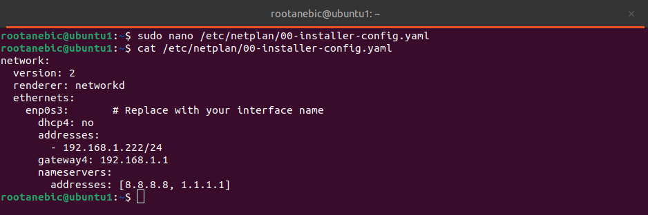
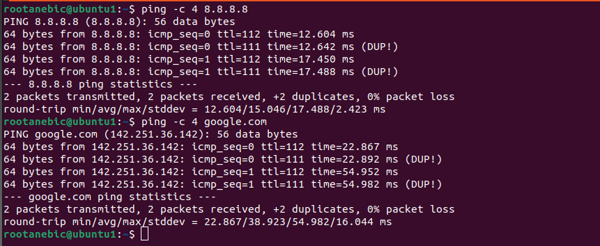
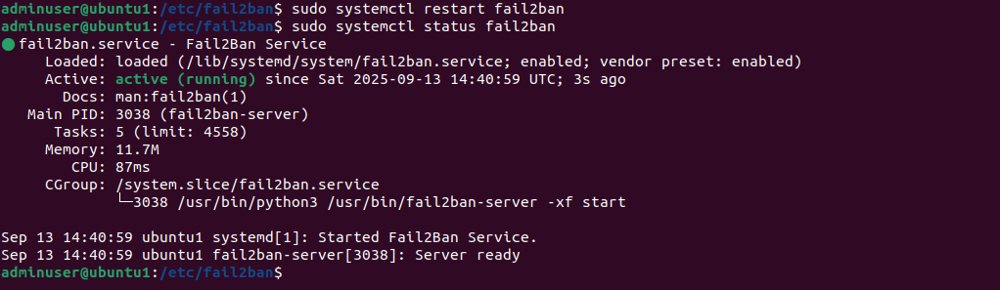

# Step 1: System Security Setup

Hi! In this guide, I'll show you step by step how I secured my Ubuntu system and set up a safe environment.

## 1. Update and Upgrade System

First, I updated my system to make sure everything is up-to-date:

```bash
sudo apt update && sudo apt upgrade -y
```

This ensures all packages are current and security fixes are applied.

---

## 2. Install Unattended Upgrades

I installed unattended upgrades so security patches are applied automatically:

```bash
sudo apt install unattended-upgrades -y
sudo dpkg-reconfigure -f noninteractive unattended-upgrades
```

---

## 3. Install Essential Dependencies

I also installed a few tools that are handy for networking, firewall, and logging:

```bash
sudo apt install -y inetutils-ping dialog ufw rsyslog
```

---

## 4. Configure Static IP Address

### 4.1 Identify Network Interface

To set a static IP, I first checked which network interface I have:

```bash
ip a
```

I found my interface was `ens33`.


---

### 4.2 Edit Netplan Configuration

I opened the Netplan configuration file:

```bash
sudo nano /etc/netplan/00-installer-config.yaml
```

Here’s what my static IP setup looks like:



---

### 4.3 Apply Network Configuration

I tested and applied the network settings:

```bash
sudo netplan try
sudo netplan apply
```

---

### 4.4 Verify Connectivity

Then I verified the internet and DNS:

```bash
ping -c 4 8.8.8.8
ping -c 4 google.com
```



Everything worked fine.

---

## 5. Create a New User with Sudo Privileges

I added a new admin user:

```bash
sudo adduser adminuser
sudo usermod -aG sudo adminuser
```

This user will be safer to use than root.

---

## 6. Set Up SSH Key Authentication

I generated my SSH key pair:

```bash
ssh-keygen -t ed25519 -f ~/.ssh/mykey
```

And copied the public key to the server:

```bash
ssh-copy-id -i ~/.ssh/mykey.pub adminuser@192.168.1.222
```

### 6.1 Harden SSH

Then I edited `/etc/ssh/sshd_config`:

```bash
sudo nano /etc/ssh/sshd_config
```

I made these changes:

```ini
PermitRootLogin no
PasswordAuthentication no
PubkeyAuthentication yes
SyslogFacility AUTH
LogLevel VERBOSE
```

Restarted SSH:

```bash
sudo systemctl restart ssh
```

This ensures only key-based logins are allowed and all attempts are logged.

---

## 7. Firewall Configuration (UFW)

I set the default firewall rules:

```bash
sudo ufw default deny incoming
sudo ufw default allow outgoing
sudo ufw allow ssh
sudo ufw enable
sudo ufw status
```


Now the server only allows necessary connections.

---

## 8. Install and Configure Fail2Ban

I installed Fail2Ban to protect against brute-force attacks:

```bash
sudo apt install fail2ban -y
```

Then created a local jail configuration:

```bash
sudo nano /etc/fail2ban/jail.local
```

My configuration:


```ini
[sshd]
enabled  = true
port     = ssh
logpath  = /var/log/auth.log
maxretry = 3
bantime  = 3600
findtime = 600
banaction = ufw
ignoreip = 192.168.1.100/32  # My workstation IP
```

Finally, I enabled and started Fail2Ban:

```bash
sudo systemctl enable --now fail2ban
sudo systemctl status fail2ban
```



---

✅ Now my system is:

* Updated and secured
* Using a static IP
* SSH is key-only with logging
* Protected by UFW and Fail2Ban
* Safe from brute-force login attempts
