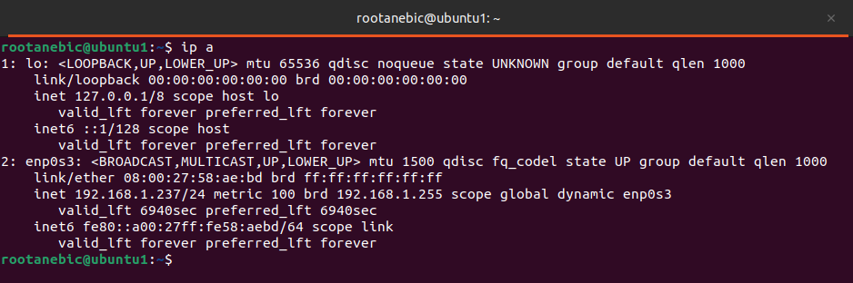
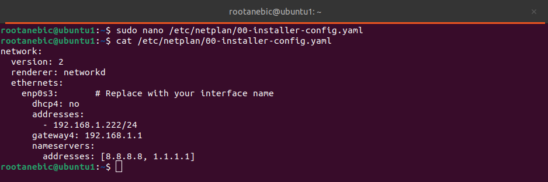
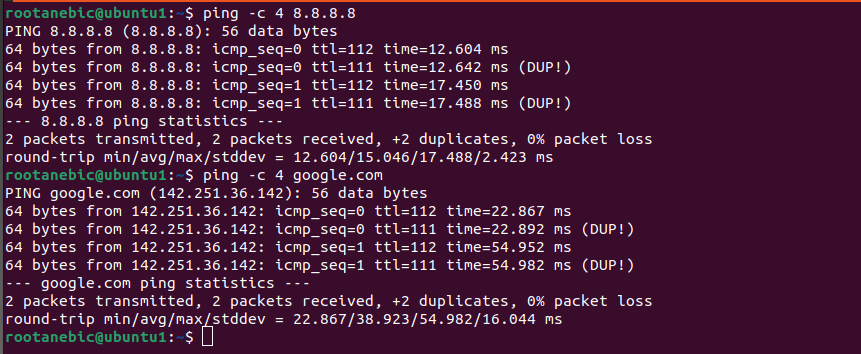

# I used Unstalled Ubuntu server with a minimal configuration, if you have installed normal, ignore dependencies below
# install dependencies
# inetutils-ping
# dialog

sudo apt update
sudo apt install inetutils-ping -y
sudo apt isntall dialog -y
inetutils-ping

# --- Set, check static IP addresses ---
#Identify network interface
ip a

#Look for an interface like ens33, eth0, or enp0s3.

#Edit Netplan config
sudo nano /etc/netplan/00-installer-config.yaml

#Example static IP configuration

# Test and apply network configuration:
sudo netplan try
sudo netplan apply

# Test if internet is reachable and dns is working
ping -c 4 8.8.8.8
ping -c 4 google.com

# Update and Upgrade System
sudo apt update && sudo apt upgrade -y

# Install unattended upgrades and set defaults non-interactivly 
sudo apt install unattended-upgrades -y
sudo dpkg-reconfigure -f noninteractive unattended-upgrades
