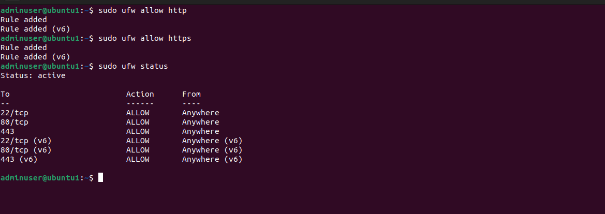

# Update and Upgrade System

sudo apt update && sudo apt upgrade -y

# Install unattended upgrades and set defaults non-interactivly 
sudo apt install unattended-upgrades -y
sudo dpkg-reconfigure -f noninteractive unattended-upgrades

# Install dependencies

sudo apt install -y inetutils-ping dialog inetutils-ping ufw rsyslog

# --- Set, check static IP addresses ---
#Identify network interface
ip a

#Look for an interface like ens33, eth0, or enp0s3.

#Edit Netplan config
sudo nano /etc/netplan/00-installer-config.yaml

#Example static IP configuration

# Test and apply network configuration:
sudo netplan try
sudo netplan apply

# Test if internet is reachable and dns is working
ping -c 4 8.8.8.8

ping -c 4 google.com

# Create user with a Sudo privileges:
sudo adduser adminuser

sudo usermod -aG sudo adminuser

#Set up SSH key authentication:
ssh-keygen -t ed25519 -f ~/.ssh/mykey

ssh-copy-id -i mykey.pub adminuser@192.168.1.222

#Harden SSH (/etc/ssh/sshd_config):
Disable root login (PermitRootLogin no)

Disable password login (PasswordAuthentication no, after key setup)

#Restart service:
sudo systemctl restart sshd

# Firewall Configuration
sudo ufw default deny incoming

sudo ufw default allow outgoing

sudo ufw allow ssh

sudo ufw enable

sudo ufw status

# Enable ssh loging
sudo nano /etc/ssh/sshd_config

SyslogFacility AUTH

LogLevel INFO

sudo systemctl restart ssh

# Install & Configure Fail2Ban
sudo apt install fail2ban -y

sudo nano /etc/fail2ban/jail.local

sudo systemctl enable --now fail2ban

sudo systemctl status fail2ban

