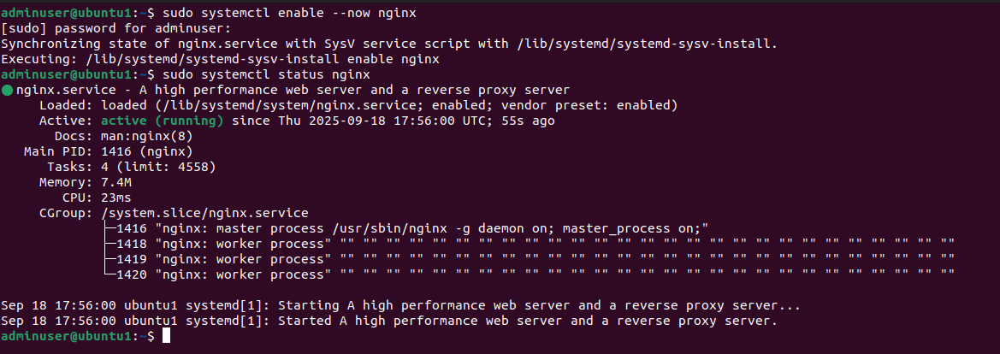
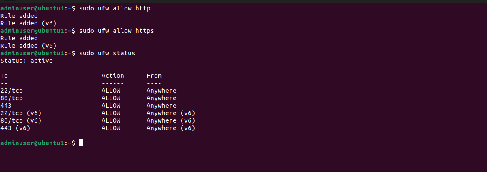
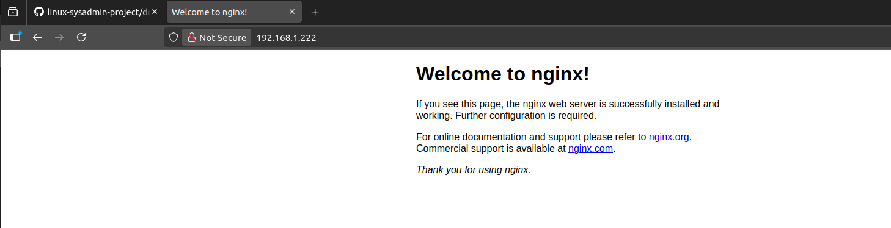
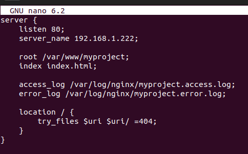
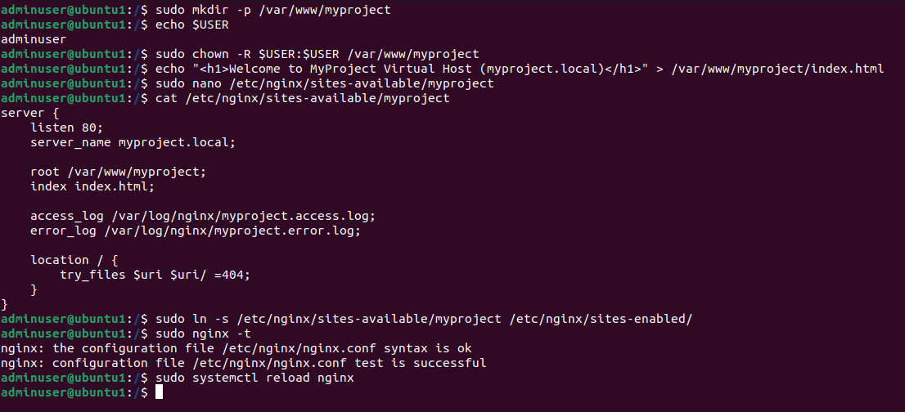
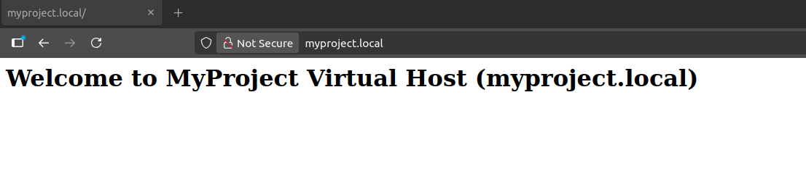
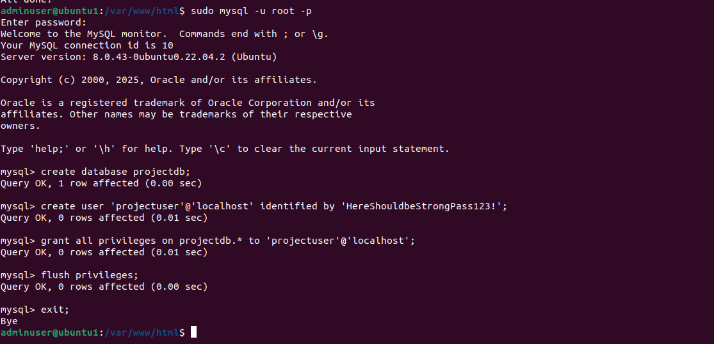
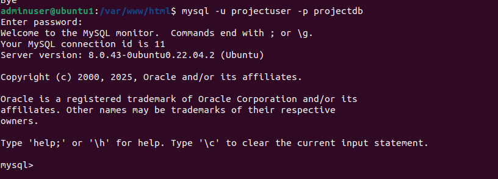
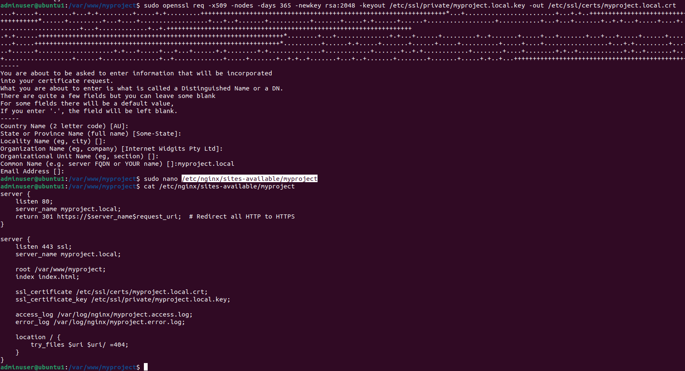
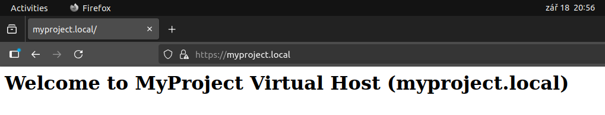

# Step 2: Web & Database Deployment (Nginx + MySQL)

Hi! In this guide, I'll show you step by step how I deployed Nginx and MySQL on my Ubuntu server, configured a local virtual host, secured it with a self-signed SSL certificate, and tested HTTP/HTTPS access.

---

## 1. Install Nginx and Configure Virtual Host

First, I installed Nginx web server and enabled service on startup:

```bash
sudo apt update
sudo apt install nginx -y
sudo systemctl enable --now nginx
sudo systemctl status nginx
```



---

## 2. Setup UFW Firewall

Configured UFW to allow HTTP and HTTPS traffic:

```bash
sudo ufw allow http
sudo ufw allow https
sudo ufw status
```



---


I tested Nginx from the browser:



---

# 3. Configure a virtual host

Then I created a website directory:

```bash
sudo mkdir -p /var/www/myproject
sudo chown -R $USER:$USER /var/www/myproject
```

And added a simple HTML page:

```bash
echo "<h1>Welcome to MyProject Virtual Host (myproject.local)</h1>" > /var/www/myproject/index.html
```

Configured a virtual host for `myproject.local`:

```bash
sudo nano /etc/nginx/sites-available/myproject
```



Enabled the site and reloaded Nginx:

```bash
sudo ln -s /etc/nginx/sites-available/myproject /etc/nginx/sites-enabled/
sudo nginx -t
sudo systemctl reload nginx
```



---

## 4. Rework Hosts on Machine

Edited `/etc/hosts` on my local machine to map `myproject.local` to the server IP:

```
192.168.1.222 myproject.local
```


---

## 5. Test HTTP Site

Accessed the site via browser:

```
http://myproject.local
```



---

## 6. Install and Configure MySQL

Installed MySQL server:

```bash
sudo apt install mysql-server -y
sudo systemctl enable --now mysql
sudo systemctl status mysql
```

Secured the installation:

```bash
sudo mysql_secure_installation
```

Created database and user:

```bash
sudo mysql -u root -p
```

Inside MySQL:

```sql
CREATE DATABASE projectdb;
CREATE USER 'projectuser'@'localhost' IDENTIFIED BY 'StrongPass123!';
GRANT ALL PRIVILEGES ON projectdb.* TO 'projectuser'@'localhost';
FLUSH PRIVILEGES;
EXIT;
```




---

## 7. Enroll and Use Self-Signed Certificate

Generated a self-signed SSL certificate for `myproject.local`:

```bash
sudo openssl req -x509 -nodes -days 365 -newkey rsa:2048 \
-keyout /etc/ssl/private/myproject.local.key \
-out /etc/ssl/certs/myproject.local.crt
```

Updated Nginx virtual host to use the certificate and reloaded Nginx:

```bash
sudo nginx -t
sudo systemctl reload nginx
```



---

## 7. Test HTTPS on the Site

Accessed the site via browser:

```
https://myproject.local
```



Browser shows a warning for the self-signed certificate, which is expected for local testing.

---

## ✅ Summary

* Nginx installed and virtual host configured.
* Hosts file updated for local domain resolution.
* UFW firewall configured for HTTP/HTTPS.
* HTTP site tested successfully.
* MySQL installed, secured, and database/user created.
* Self-signed SSL certificate applied.
* HTTPS site tested successfully.
